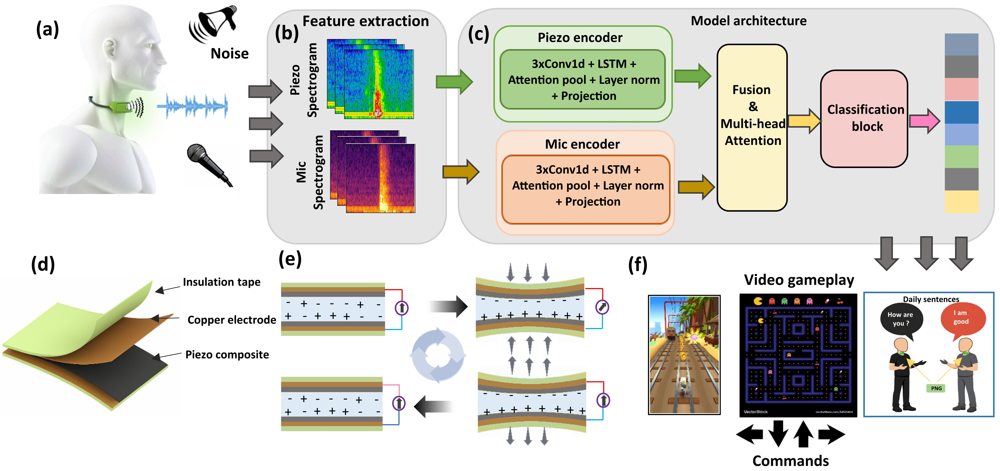

# CLAF-Speech  
Noise-Robust Multimodal Speech Recognition using Piezoelectric Throat Vibrations and Microphone Audio

---

## 🖼 Graphical Abstract

  

---

## 📌 Overview

CLAF-Speech is a multimodal deep learning framework for robust speech recognition in noisy environments.

The system combines:

- 🎧 Throat-mounted piezoelectric vibration sensing (PNG)
- 🎙️ Airborne microphone audio
- 🧠 Attention-based feature-level fusion (CLAF)

By integrating body-coupled throat vibrations with microphone signals, the model maintains high recognition accuracy even under extreme acoustic noise conditions.

---

## 🧠 Method Summary

The framework consists of:

- Modality-specific CNN–LSTM encoders  
- Multi-head self-attention fusion  
- Lightweight classification head  

The attention mechanism adaptively weights each modality depending on reliability, enabling stable performance when the microphone channel degrades in noise.

---

## 📊 Key Capabilities

- Noise-robust speech recognition  
- Multimodal feature fusion  
- Speaker recognition  
- Assistive communication applications  

---

## 📂 Expected Dataset Structure

DATA_PATH/
Class_1/
audio_1.wav
piezo_1.wav
audio_2.wav
piezo_2.wav
Class_2/
...

Each sample must contain synchronized:
- `audio_*.wav`
- `piezo_*.wav`

---

## ⚙️ Requirements

- Python 3.9+
- PyTorch
- NumPy
- Librosa
- Scikit-learn
- Matplotlib

---

## ▶️ Run Training

Edit the DATA_PATH inside the script, then run:

python CLAF.py

